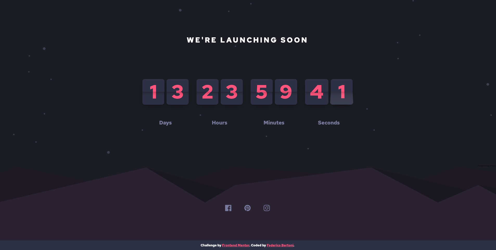

# Launch countdown timer

This is a solution to the [Launch countdown timer challenge on Frontend Mentor](https://www.frontendmentor.io/challenges/launch-countdown-timer-N0XkGfyz-).

## Overview

### The challenge

Users should be able to:

- See hover states for all interactive elements on the page
- See a live countdown timer that ticks down every second
- **Bonus**: When a number changes, make the card flip from the middle

### Screenshot

### Links

- Live Site URL: [Countdown](https://fedechini.github.io/launch-countdown-timer/)

## Author

- Frontend Mentor - [@Fedechini](https://www.frontendmentor.io/profile/Fedechini)
